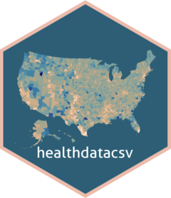

<!-- README.md is generated from README.Rmd. Please edit that file -->

```{r, include = FALSE}
knitr::opts_chunk$set(
  collapse = TRUE,
  comment = "#>",
  fig.path = "man/figures/README-",
  out.width = "100%",
  message = FALSE,
  warning = FALSE
)

devtools::load_all()

```

# healthdatacsv 

<!-- badges: start -->
[](https://www.tidyverse.org/lifecycle/#maturing)
[](https://travis-ci.org/iecastro/healthdatacsv)
[](https://codecov.io/gh/iecastro/healthdatacsv?branch=master)
[](https://github.com/ropensci/software-review/issues/358)
[](https://ci.appveyor.com/project/iecastro/healthdatacsv)
<!-- badges: end -->

**healthdatacsv** allows users to query the [healthdata.gov API](https://healthdata.gov/node/25341) catalog and return tidy data frames. This package focuses on the data.json endpoint and will download datasets if available via file download, namely, in csv format.  

## Installation

You can install the development version of **healthdatacsv** from [GitHub](https://github.com/) with:

``` {r, eval = FALSE}
install.packages("remotes")
remotes::install_github("iecastro/healthdatacsv")

```

## Examples

```{r}
library(healthdatacsv)
```

Basic examples which show you how to use **healthdatacsv**:  

- Querying API based on keywords:  

```{r example}
fetch_catalog(keyword = "alcohol|drugs")

```

- Querying API and downloading data for single product:  

```{r}
fetch_catalog("Centers for Disease Control and Prevention",
                               keyword = "built environment") %>% 
  fetch_csv()

```

- Querying API and downloading data for multiple data products.  Data will be nested in a list-column:  

```{r} 
library(dplyr) # for table manipulation verbs

# query catalog
fetch_catalog(keyword = "alcohol")

# fetch data
fetch_catalog(keyword = "alcohol") %>% 
  slice(1:2) %>% # dplyr 
  fetch_csv()

```

`fetch_csv()` wraps the [vroom](https://vroom.r-lib.org/) function, which helps quickly read relatively large delimited files:  

```{r}
# PRAMS data
# CDC surveillance for reproductive health

# query catalog for available products
fetch_catalog(keyword = "reproductive health") %>% 
  select(1:2)

# query, filter, and fetch
prams <- fetch_catalog(keyword = "reproductive health") %>% 
  mutate(year = readr::parse_number(product)) %>% 
  filter(year > 2008) %>% 
  arrange(year) %>% 
  fetch_csv()

prams %>% 
  select(product, data_tbl)

```


## Basic workflow

**healthdatacsv** is pipe friendly, so it's easy to integrate into a tidy workflow. For example, say you're interested in searching CDC datasets related to the built environment.  

Let's fetch the catalog of available data products:

```{r}
cdc_built_env <- fetch_catalog("Centers for Disease Control and Prevention",
                               keyword = "built environment")

cdc_built_env

```

In this case, there is only one product available.  To learn more about the dataset, you can simply `pull` the description:

```{r}
cdc_built_env %>%
  dplyr::pull(description)

```

This dataset relates to state legislation on nutrition, physical activity, and obesity during 2001-2017.  Data only includes enacted legislation.

To download the data, we pass the catalog df to the `fetch_csv` function.  Since there is only one dataset to download, we can `unnest` in the same pipe.  *If the catalog has more than one product that you'd like to keep, it is recommended to unnest each product separately.* If the catalog consists of several time points of the same dataset, you could unnest in one pipe, given all column names are the same. 


```{r}
data_raw <- cdc_built_env %>%
  fetch_csv() %>% #> 
  tidyr::unnest(data_tbl)

data_raw %>%
  glimpse()

```


### Some helper functions

`list_agencies()` will query and download names of agencies listed in the catalog. You can enter partial name or initials of agency of interest to check if it has data cataloged in the API. Argument relies on [regular expression](https://stringr.tidyverse.org/articles/regular-expressions.html) to detect string matches.

```{r}

list_agencies("NIH|CDC|FDA")

list_agencies("Institute|Drug")

```

The resulting dataframe will depend on matches to the string supplied. To pull all agencies cataloged, simply use `list_agencies` with the default argument:

```{r}
list_agencies() %>% 
  print(n=Inf)

```

`get_keywords()` will extract all keywords cataloged. The function accepts as argument a full *agency* name (in proper title case) which can be obtained with `list_agencies`.  

```{r}
get_keywords("National Institutes of Health (NIH)")

```


Conversely, this function can be run with the default value for a data frame of all keywords and agencies cataloged.

```{r}
get_keywords()

```

Additionally, keywords object can be loaded to the data viewer for easier filtering, and text search by setting the `data_viewer` argument to `TRUE`:

```{r, eval = FALSE}
get_keywords("National Institutes of Health (NIH)",
             data_viewer = TRUE)

```


#### Info

Development of this package was partly supported by a research grant from the National Institute on Alcohol Abuse and Alcoholism - NIH Grant #R34AA026745. This product is not endorsed nor certified by either healthdata.gov or NIH/NIAAA.  

Please note that the 'healthdatacsv' project is released with a [Contributor Code of Conduct](.github/CODE_OF_CONDUCT.md). By contributing to this project, you agree to abide by its terms.  


